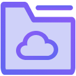
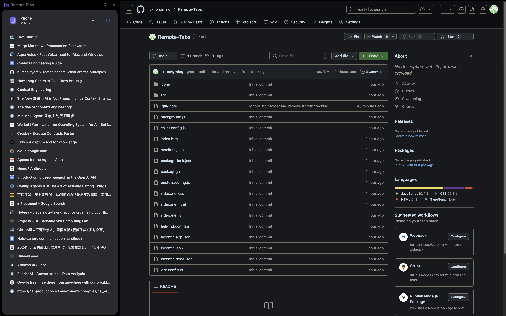

# Remote Tabs

**Remote Tabs** is a Chrome extension that allows you to view and manage open tabs from all your devices directly in a convenient sidebar. This extension leverages Chrome's sync and sessions APIs to provide a seamless cross-device browsing experience.

## Features

- **View Tabs from All Devices:**
  - See open tabs from all devices where you are signed into Chrome and have sync enabled.
  - Tabs are grouped by device (e.g., your phone, tablet, laptop, etc.).
- **Device Selection:**
  - Easily switch between devices using a dropdown menu in the sidebar.
  - Device icons help you quickly identify device types (phone, tablet, laptop, etc.).
- **Tab Management:**
  - Open any remote tab in a new tab or window on your current device.
  - Copy tab URLs or titles to your clipboard with right click.
  - For tabs on your current device, you can also close them directly from the sidebar (closing remote tabs is not currently supported in API).
- **Search Tabs:**
  - Quickly filter tabs by title or URL using the search bar.
- **Auto-Refresh:**
  - Tabs and devices auto-refresh every 60 seconds.

## Screenshots

## Installation

1. **Download the Latest Release:**
   - Go to the [Releases](https://github.com/yourusername/remote-tabs/releases) page of this repository.
   - Download the latest `.crx` file.
2. **Install the Extension in Chrome:**
   - Open `chrome://extensions/` in your Chrome browser.
   - Enable **Developer mode** (toggle in the top right corner).
   - Drag and drop the downloaded `.crx` file onto the extensions page.
   - Confirm the installation when prompted.

## Usage

- Click the Remote Tabs extension icon to open the sidebar.
- Use the device dropdown to select which device's tabs to view.
- Click on a tab to open it, or right-click for more options.
- Use the search bar to filter tabs by title or URL.

## Permissions Explained

- `tabs` — To read and manage tabs on your current device
- `sessions` — To access tabs from your other devices via Chrome Sync
- `sidePanel` — To display the sidebar UI
- `storage` — To save your preferences (selected device, expanded groups, etc.)
- `host_permissions` — To allow opening tabs from any website
